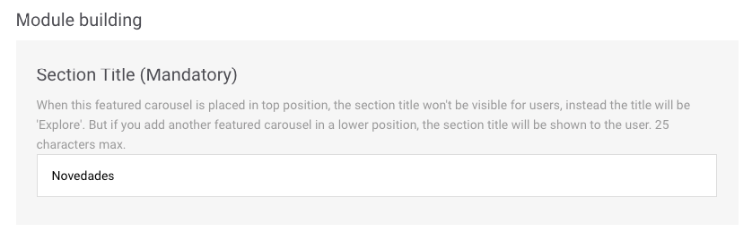

# FAQ

## Um módulo pode estar em vários layouts ao mesmo tempo?

É claro que pode. Então, leve em consideração que as mudanças realizadas em um módulo podem afetar vários layouts.

Quando da edição de um módulo, pode ver em que layout ou layouts está:

## Somente quero mudar um detalhe de um módulo para um layout, mas esse módulo também está sendo utilizado em outro layout. O que posso fazer?

Se deseja que essa mudança afete só um layout, crie outro módulo igual, mas que também inclua o detalhe que quer modificar. Nesse momento, você possuirá dois módulos criados. Use o módulo que precisar em cada layout.


Por exemplo

_Tenho os layouts **Layout android prepay** e **Layout ios prepay**. Em ambos, está o módulo **Rows Club Movistar**:_

_Decidi que uma das informações sobre o preço que vou exibir não seja a mesma para Android do que para iOS._

_O que devo fazer?_

Nesse caso, você deve criar um novo módulo. Coloque o nome, por exemplo, _Club Movistar iOS_ . A configuração será a mesma que para o módulo que já possuía \(_Club Movistar_\), mas com o dado sobre o preço para iOS modificado, tal e como você desejava.

Seguidamente, quando esse módulo já estiver criado, acesse o arquivo de Layouts e edite **Layout ios prepay** . Elimine o módulo **Row Club Movistar** e adicione o novo módulo criado, **Row Club Movistar iOS**.



Lembrese de ordenar os módulos tal e como quer que eles apareçam, porque o novo módulo adicionado estará no último lugar.


## Fiz uma mudança em um módulo e quero publicála. Onde posso fazêla?

Em verdade, os módulos não são publicados; o que é publicado é o layout. O motivo é simples: uma mudança em um módulo pode afetar vários layouts ao mesmo tempo e é possível que essa não seja sua intenção. Por essa razão, o que sempre serão publicados são layouts.

🎯 Não sabe como publicar um layout? Isto pode ser de interesse 👇



## Realizei mudanças em um layout, mas ainda não as publiquei. Posso prévisualizar essas mudanças antes de tornálas visíveis para todos os usuários?

Sim, é claro que pode. Consulte este link 👇



## Quero criar um novo layout. Como posso fazer?

Você não pode criar um novo layout, porque os layouts já estão configurados segundo a segmentação de seus clientes. Lembrese, sistema operacional, modelo de pagamento.

## Quero usar um módulo tipo _Featured Content_ , mas gostaria que aparecesse depois de outro módulo que já tenho criado. É possível colocá-lo em qualquer posição?

Certamente. Você pode colocálo na posição que desejar dentro do layout. Contudo, tenha em conta que o título mostrado, nesse caso, será aquele definido no campo **Section Title**.


Ainda, considere que, na primeira posição, sempre deve existir um módulo do tipo _Featured Content_ , independente de usar mais deste tipo na composição do seu layout.


Não tenho usuário para acessar o Explore CMS. Como obtêlo?

Contate diretamente sua equipe de NOVUM. Eles irão diligenciar seu acesso.

