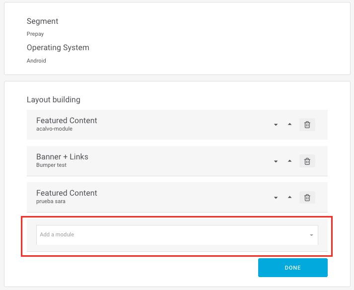
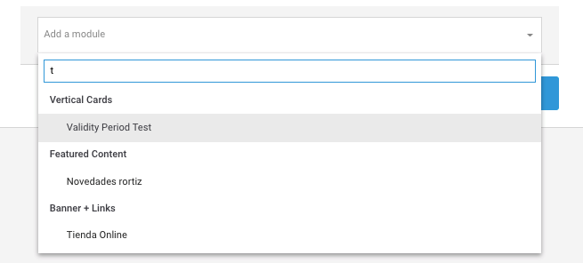
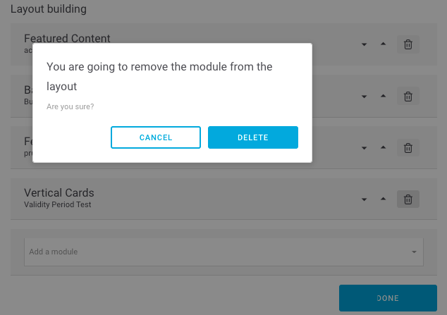

# Edição do Layout

Observe que um layout é uma unidade de conteúdo integrada por vários módulos. A composição completa de módulos é aquilo que o usuário pode ver no aplicativo. Este layout é baseado nos segmentos ou combinação de segmentos de usuários aos quais foi direcionado o conteúdo \(prépagamento, contrato, sistema operacional\).

Os layouts que atualmente estão disponíveis dependem da OB e de suas características.

Para editar um layout existente em Explore CMS e publicálo, acesse o arquivo de layouts e clique em  na fileira do layout correspondente.

No cabeçalho do modo de edição de layout, você encontrará informações sobre:

**Segment**. Segmento do layout: **Prepay** \(prépagamento\) ou **Postpay** \(póspagamento\).

**Operating System.** Sistema operacional do segmento ao qual foi direcionado o layout: **iOS** ou **Android**.

## Layout building

Nesta seção, configure o layout indicando os módulos que mostrará e a ordem em que o usuário poderá vêlos em Explore. Também poderá criar um módulo daqui.

### Como mudar a ordem de um módulo no layout

Clique nas setas  da lista para subir e descer a posição do módulo.


Observe que, na primeira posição, sempre deve existir um módulo do tipo [_Featured Content_](../modulo/readme_pt-br/featured-content_pt-br.md).


### Como adicionar um módulo da edição de layouts

Selecione no menu suspenso o módulo que deseja adicionar.

Utilize a funcionalidade de preenchimento automático: comece digitando o nome do módulo e, de maneira automática, os módulos que coincidam com sua pesquisa serão filtrados.

### Como eliminar um módulo de um layout

Para que um módulo não seja exibido em um layout, clique no ícone  do módulo correspondente.

Clique em **DELETE** para aceitar a mensagem exibida na tela e confirmar a ação de eliminação.


A ação que elimina um módulo de um layout não elimina o módulo do arquivo de módulos. Por isso, você pode usálo em outro momento se for necessário.


Ao finalizar a edição do layout, clique no botão **DONE**.


Quando clicar em **DONE**, o layout ficará editado mas ainda não será publicado.


