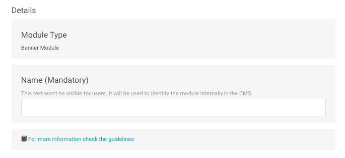
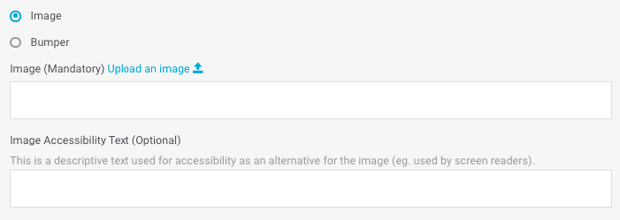

# Banner + links

Os módulos do tipo _Banner_ simplesmente contêm uma imagem ou um _bumper_ com um link.

💡 \_\_**Você sabia?**

Um _bumper_ é um vídeo curto ou animação. Em geral, é um formato padrão com duração média aproximada de 6 segundos e costuma ser utilizado em objetivos comerciais.

Preencha os campos obrigatórios e decida se precisa completar quaisquer dos campos opcionais:

## Details

**Name**. Nome que identifica internamente o elemento. Nunca é exibido no app, mas com esse nome pode identificar o módulo ao visualizar a lista de módulos.‌

​​🔅 Não há extensão máxima e é **obrigatório**.‌

**For more information check the guidelines**. Consulte os guias de desenho referentes ao módulo que está criando ou editando. Verifiqueos para garantir que o conteúdo que está sendo carregado possui a melhor qualidade possível.

## Module building

### Banner

Para cada _banner_, os campos disponíveis podem variar segundo for selecionada uma imagem ou um _bumper_:

* **Image**. Exibe uma imagem estática.
* **Bumper**. Exibe um vídeo curto ou animação.




**Image Upload an image** 📤. URL da imagem do _banner_. Deve ter o formato de URL próprio do CMS.

Clique no link **Upload an image** 📤 _\*\*_e selecione a imagem diretamente de seu computador. Uma vez processado o upload da imagem, o URL é preenchido automaticamente no campo de texto.

Quando a imagem for carregada, será possível prévisualizála logo abaixo.

🔅 Este campo é **obrigatório**.

**Image Accesibility Text**. Descrição da imagem utilizada para acessibilidade, como alternativa se não é possível exibir a imagem \(por exemplo, para pessoas com problemas de visão\).

🔅 Não há extensão máxima e é **opcional**.




**Bumper Upload a bumper** 📤. É preenchido automaticamente com o nome do _bumper_.

Para carregar um bumper, há duas opções:

1. Clique no link **Upload a bumper** 📤 e carregue um _bumper_ de seu computador.
2. Abra a lista dos _bumpers_ e selecione um dos que já foram carregados.

Ative a opção **Play in loop** para que o _bumper_ seja reproduzido em loop no Explore. Com a opção desativada, será reproduzido a cada vez que o _bumper_ acessar a tela, mas para quando finaliza a reprodução.

Quando o _bump\_e\_r_ for carregado, será possível prévisualizar logo abaixo:

**Bumper Accesibility Text** . Descrição do _bumper_ utilizado para acessibilidade, como alternativa se não é possível exibir o _bumper_ \(por exemplo, para pessoas com problemas de visão\).

🔅 Não há extensão máxima e é **opcional**.



**Action URL**. URL do _banner_, isto é, a URL que é acessada ao clicar no _banner_.

🔅 É **obrigatória** e deve ser uma URL válida \(por exemplo: [`https://www.google.com`](https://www.google.com)\)

**Card Starting date and time**. Data e hora que você deseja para iniciar a exibição do _banner_ aos usuários.

🔅 É opcional.

**Card Ending date and time**. Data e hora que você deseja para finalizar a exibição do _banner_ aos usuários.

🔅 É opcional.

**Card Micro-segments**. Etiquetas que é possível adicionar, sempre separadas com vírgulas, para realizar uma segmentação dos usuários que observarão o conteúdo que está sendo criado.

### Link

De maneira opcional, você pode adicionar links na parte inferior do _banner_. Para isso, preencha para cada link que deseja adicionar \(máximo de 5 links\) os campos abaixo:

**Name**. Nome do link \(por exemplo, `Vantagens`\).

🔅 A extensão máxima é **38 caracteres** e é **obrigatório**.

**Action. URL** que aparece ao clicar no **Name** , isto é, no nome do link.

🔅 É obrigatória e deve ser uma URL válida \(por exemplo: [`https://www.google.com`](https://www.google.com)\)

